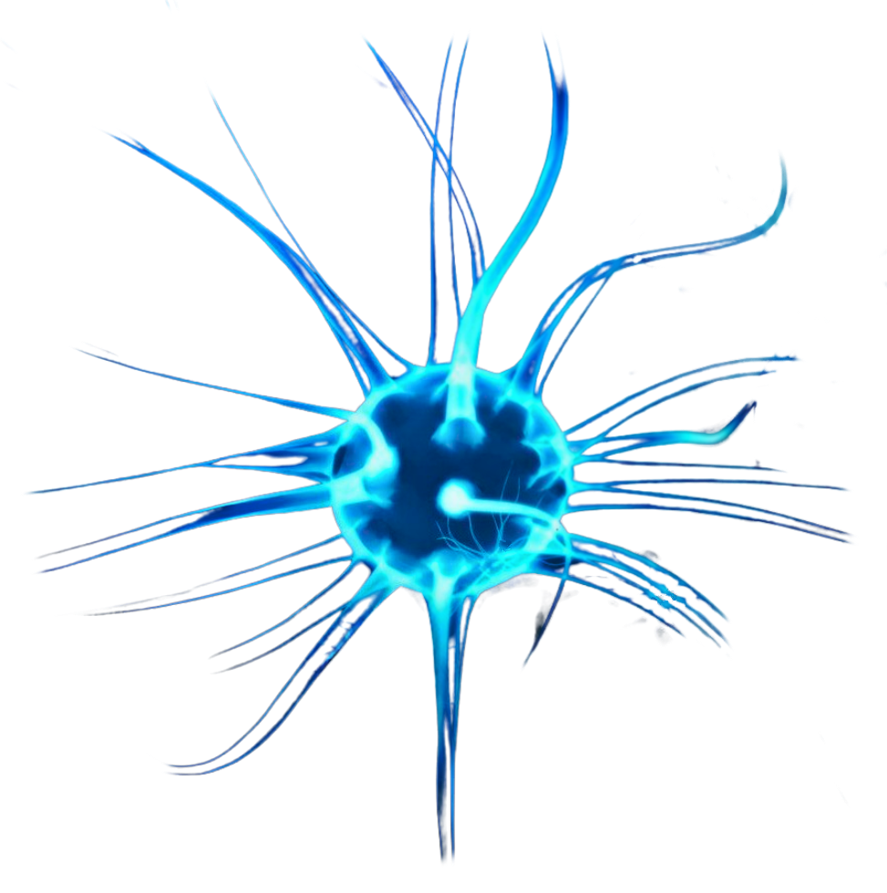

<div align="center">
  
  
  # O.P.E.R.A.T.O.R
  
  ### Operational Platform for Enhanced Reasoning and Task Automation
  
  [](LICENSE)
  [](https://github.com/dexters-lab-ai/nexus/releases)
  [](https://discord.gg/OPERATORai)
  [](https://twitter.com/dexters_ai_lab)
  
  ---
</div>

## 🌟 Overview

O.P.E.R.A.T.O.R is an advanced AI assistant that transforms natural language into automated browser and computer tasks. It combines multiple state-of-the-art language models with a powerful automation engine to understand and execute complex workflows across web and desktop applications.

## ✨ Key Features

### 🤖 Multi-Model Architecture
- **Diverse AI Models**: Choose from leading AI providers including OpenAI, Google, Alibaba, and ByteDance
- **Specialized Capabilities**: Each model excels in different areas (vision, reasoning, UI interaction, etc.)
- **Model Comparison**: Easily compare outputs from different models for optimal results

### 🛠️ Core Capabilities
- **Natural Language Understanding**: Convert plain English instructions into automated actions
- **Visual Grounding**: Advanced computer vision for precise UI element interaction
- **Workflow Automation**: Chain multiple tasks into complex, automated workflows
- **YAML Integration**: Define and execute tasks using structured YAML configuration
- **Cross-Platform**: Works seamlessly across Windows, macOS, and Linux

### 🎯 Use Cases
- **Smart Shopping Assistant**: Price comparisons, deal tracking, and purchase automation
- **Job Application Manager**: Automate job searches, applications, and follow-ups
- **Meeting Assistant**: Join, transcribe, and summarize meetings with action items
- **Workflow Automation**: Connect multiple applications and services in custom workflows
- **Data Extraction**: Scrape and organize web data intelligently

## 🚀 Getting Started

### Prerequisites
- Node.js 16+ and npm 8+
- Modern web browser (Chrome, Firefox, Edge, or Safari)
- API keys for your preferred AI providers

### Installation

```bash
# Clone the repository
git clone https://github.com/dexters-lab-ai/operator.git
cd operator

# Install dependencies
npm install
```

---

## ⚙️ Environment Configuration

O.P.E.R.A.T.O.R uses environment variables for configuration. You must set up the following files:

- `.env` — for development (not committed)
- `.env.production` — for production (not committed)
- `.env.example` — template/example (committed)

**Required variables:**
- `NODE_ENV` — set to `development` or `production`
- `PORT` — backend API port (default: `3420`)
- `FRONTEND_URL` — frontend URL (default: `http://localhost:3000`)
- `API_URL` — backend API URL (default: `http://localhost:3420`)
- `VITE_FRONTEND_URL`, `VITE_API_URL`, `VITE_WS_URL` — for Vite frontend (use production URLs in `.env.production`)
- All secret/API keys as needed

> **Tip:** Copy `.env.example` to `.env` and `.env.production`, then fill in your values.

```bash
cp .env.example .env
cp .env.example .env.production
```

---

## 🚀 Development

```bash
# Start Vite frontend (port 3000)
npm run dev

# Start Node.js backend (port 3420)
npm run serve:dev
```

- Access the app at: [http://localhost:3000](http://localhost:3000)
- Backend API at: [http://localhost:3420](http://localhost:3420)

---

## 📱 Device Automation

O.P.E.R.A.T.O.R provides powerful Android device automation capabilities through multiple connection methods. Choose the option that best fits your needs:

### Connection Methods

#### 1. USB Connection (Recommended)
**Best for:** Local development and debugging  
**Speed:** ⚡⚡⚡⚡⚡ (Fastest)  
**Stability:** ⭐⭐⭐⭐⭐ (Most stable)

**Setup Instructions:**
1. Enable USB Debugging on your Android device:
   - Go to **Settings** > **About Phone**
   - Tap **Build Number** 7 times to enable Developer Options
   - Go to **System** > **Developer Options**
   - Enable **USB Debugging**
2. Connect your device via USB
3. In O.P.E.R.A.T.O.R, select **USB** as the connection type
4. Click **Connect** and authorize the connection on your device

#### 2. Network Connection
**Best for:** Wireless testing and multi-device setups  
**Speed:** ⚡⚡⚡ (Depends on network)  
**Convenience:** ⭐⭐⭐⭐⭐ (No cables needed)

**Setup Instructions:**
1. First, connect your device via USB and enable USB debugging
2. Open a command prompt/terminal and run: `adb tcpip 5555`
3. Note your device's IP address in **Settings** > **About Phone** > **Status**
4. In O.P.E.R.A.T.O.R, select **Network** as the connection type
5. Enter your device's IP address (port defaults to 5555)
6. Click **Connect**
7. You can now disconnect the USB cable

#### 3. Remote ADB (Advanced)
**Best for:** Teams and CI/CD pipelines  
**Flexibility:** ⭐⭐⭐⭐⭐ (Access anywhere)  
**Setup:** ⚙️⚙️⚙️ (Advanced configuration)

**Setup Instructions:**
1. On the computer with your Android device connected:
   - Open a command prompt/terminal as administrator
   - Navigate to your ADB directory (e.g., `cd C:\platform-tools`)
   - Start the ADB server: `adb -a -P 5037 nodaemon server`
   - Note the computer's IP address
2. In O.P.E.R.A.T.O.R:
   - Select **Remote ADB** as the connection type
   - Enter the ADB server's IP and port (default: 5037)
   - If needed, specify the path to ADB executable
   - Click **Save Settings** then **Test Connection**

### Troubleshooting

#### Device Not Found
- Verify USB debugging is enabled
- Try a different USB cable/port
- Run: `adb kill-server && adb start-server`
- Ensure proper USB drivers are installed

#### Connection Drops
- Check WiFi/network stability
- Ensure device IP hasn't changed (for network connections)
- Verify port 5555 is open (network mode)
- Check for firewall/antivirus blocking the connection

#### Docker Limitation
When running in a Docker container, network ADB connections may not work due to network namespace isolation. For development and testing, run the app directly on your host machine.

### Requirements
- Android device with USB debugging enabled
- ADB (Android Debug Bridge) installed
- For USB: Proper USB drivers for your device
- For network: Device and computer on the same network
- For remote ADB: ADB server running on the host machine

### Security Notes
- Only enable USB debugging for trusted computers
- Be cautious when connecting to public networks
- Use secure connections for remote ADB access
- Keep your ADB version updated to the latest release

---

## 🧪 Production Build & Run

### Build Frontend

```bash
npm run build
```

### Start Production Server

```bash
npm run serve
```

- App runs with production settings from `.env.production`
- Access the app at your configured production URLs

---

## 🔎 Production Preview (Local Production Test)

To test your production build locally:

```bash
npm run build
cross-env NODE_ENV=production node server.js
```

- This uses `.env.production` and runs the server on port 3420 by default
- Access the frontend at [http://localhost:3000](http://localhost:3000) if using Vite preview, or your configured `FRONTEND_URL`

---

## 💡 Troubleshooting

- **Environment Variables Not Loading?**
  - Ensure you use the correct `.env` file for the mode (`.env` for dev, `.env.production` for prod)
  - On Windows, always use `cross-env` in npm scripts to set `NODE_ENV`
  - Restart your terminal after changing env files
- **Ports Not Matching?**
  - Backend defaults to `3420`, frontend to `3000` (update your env files if you change these)
- **Missing Dependencies?**
  - Run `npm install` to ensure all dependencies (including `cross-env`) are installed

---

### 🕵️ Diagnosing User Connection Issues

O.P.E.R.A.T.O.R relies on WebSocket connections to deliver real-time features such as the Neural Canvas and planLogs. If a user is not connected, some features will not work or render.

#### How to Diagnose:

- **Check WebSocket Connection Status**
  - In the browser console, look for `[WebSocket] Connection established for userId=...`.
  - If you see repeated reconnect attempts or errors, the connection is failing.
  - On the server, logs like `[WebSocket] Sending update to userId=...` and `connectionCount` show if the backend sees the user as connected.
- **Test with test-websocket.mjs**
  - Use the provided `test-websocket.mjs` script to simulate a user connection and see if the server accepts and responds.
- **User ID Sync**
  - The frontend (`CommandCenter.jsx`) syncs userId with `/api/whoami` and stores it in local/session storage. If userId is missing or not synced, the WebSocket will not initialize.
- **Missing WebSocket Events**
  - If the Neural Canvas or planLogs do not render, it may be because the browser is not receiving `functionCallPartial` or related events from the server.
  - This is often due to a lost or failed WebSocket connection. Check browser and server logs for errors.
- **Queued Messages**
  - The server queues messages for users who are temporarily disconnected. When the user reconnects, queued messages are sent. If you see `[WebSocket] No active connections for userId=... Queuing message.`, the user is not currently connected.

#### What to do:

- Refresh the browser and check for connection logs.
- Check your `.env` and `.env.production` for correct `VITE_WS_URL` and `API_URL` values.
- Make sure your firewall or reverse proxy is not blocking WebSocket traffic (port 3420 by default).
- If using a production deployment, ensure your frontend is connecting to the correct backend WebSocket endpoint.
- For persistent issues, check both client and server logs for `[WebSocket]` errors or warnings.

> If the Neural Canvas or other real-time features do not update, it is almost always a user connection/WebSocket issue.


### Production in Docker - DigitalOcean

1. **Create a DigitalOcean Account**
   - Sign up at [DigitalOcean](https://cloud.digitalocean.com/)
   - Complete email verification and account setup

2. **Create a New App**
   - Go to the Apps section
   - Click "Create" > "Apps"
   - Choose GitHub as the source
   - Select your repository with this codebase
   - Select the main branch

3. **Configure App Settings**
   - Under "App Name", enter your preferred name
   - Select the region closest to your users
   - Click "Next" to continue

4. **Environment Variables**
   - Go to the "Settings" tab
   - Click "Edit" in the "App-Level Environment Variables" section
   - Copy and paste the contents of your `.env.production` file
   - Click "Save"

5. **Configure Ports**
   - In the "App" section of Settings, click "Edit"
   - Add the following HTTP ports:
     - `3000` (Frontend)
     - `3420` (Backend API)
   - Set the health check to use TCP protocol

6. **Run Command**
   - In the "App" section, find "Run Command"
   - Enter: `node server.js`
   - Click "Save"

7. **Deploy**
   - Go to the "Deployments" tab
   - Click "Deploy"
   - Wait for the deployment to complete

8. **Access Your App**
   - Once deployed, find your app's URL in the "Domains" section
   - The app will be available at `https://your-app-name.ondigitalocean.app`

## 🧩 Features in Detail

### Multi-Model Support
O.P.E.R.A.T.O.R supports various AI models, each with unique strengths:

| Model | Provider | Strengths | Best For |
|-------|----------|-----------|----------|
| GPT-4o | OpenAI | Advanced reasoning, code generation | General tasks, complex workflows |
| Qwen-2.5-VL 72B | Alibaba | Visual grounding, UI interaction | Precise element targeting |
| Gemini-2.5-Pro | Visual understanding, multimodal | Research, data analysis |
| UI-TARS | ByteDance | End-to-end GUI automation | Complex UI workflows |
| Claude 3 Opus | Anthropic | Safety, instruction-following | Sensitive tasks |
| Grok-1 | xAI | Real-time data, conversational | Interactive tasks |

### Execution Modes

1. **Step Planning (Default)**
   - Processes tasks step-by-step with validation
   - Provides detailed progress updates
   - Ideal for complex or critical tasks

2. **Action Planning (Autopilot)**
   - Plans complete sequence of actions upfront
   - More efficient for routine tasks
   - Reduces completion time

3. **YAML Planning (Recommended)**
   - Uses structured YAML for precise control
   - Enables complex workflow definitions
   - Provides transparency and reproducibility

### YAML Workflow Automation

Define complex workflows using YAML:

```yaml
name: Research Assistant
version: 1.0
tasks:
  - name: Search Academic Papers
    action: web.search
    params:
      query: "machine learning applications in healthcare"
      source: "google_scholar"
      limit: 5
    
  - name: Extract Key Findings
    action: ai.analyze
    params:
      content: "{{task_1.results}}"
      instructions: "Summarize key findings and methodologies"
    
  - name: Generate Report
    action: docs.create
    params:
      title: "Research Summary - {{date}}"
      content: "{{task_2.summary}}"
      format: "markdown"
```

## 🛠️ Configuration

### Environment Variables
Create a `.env` file in the root directory:

```env
PORT=3400
NODE_ENV=development
API_KEYS={
  "openai": "your-openai-key",
  "google": "your-google-key",
  "qwen": "your-qwen-key"
}
```

### API Keys
Configure your API keys in the Settings panel:
1. Click the gear icon in the top-right corner
2. Navigate to "API Keys" tab
3. Enter your keys for each provider
4. Click "Save"

## 📚 Documentation

For detailed documentation, please visit our [Documentation Portal](https://dexters-ai-lab.gitbook.io/dexters-ai-lab/getting-started/publish-your-docs-1).

### Key Components
- **Frontend**: React with Vite, VanillaJs
- **Backend**: Node.js with Express
- **Real-time**: WebSocket integration
- **Database**: MongoDB (optional)

## 🤝 Contributing

We welcome contributions! Please read our [Contributing Guidelines](CONTRIBUTING.md) to get started.

1. Fork the repository
2. Create your feature branch (`git checkout -b feature/AmazingFeature`)
3. Commit your changes (`git commit -m 'Add some AmazingFeature'`)
4. Push to the branch (`git push origin feature/AmazingFeature`)
5. Open a Pull Request

## 📄 License

This project is licensed under the MIT License - see the [LICENSE](LICENSE) file for details.

## 👥 Community

Join our growing community:

- [Dorahacks](https://dorahacks.io/buidl/24088/) - Follow the Buidl
- [GitHub Issues](https://github.com/dexters-lab-ai/Nexus/issues) - Report issues
- [Twitter](https://twitter.com/dexters_ai_lab) - Latest updates
- [Telegram](/) - Professional network

## 🙏 Acknowledgments

- Jesus first. All the amazing open-source projects that made this possible
- Our wonderful community of contributors and users
- The AI/ML community for continuous innovation

---

<div align="center">
  Made with ❤️ by the D.A.I.L Team
</div>
